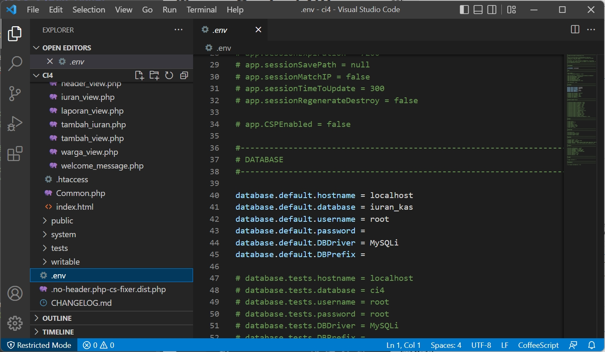
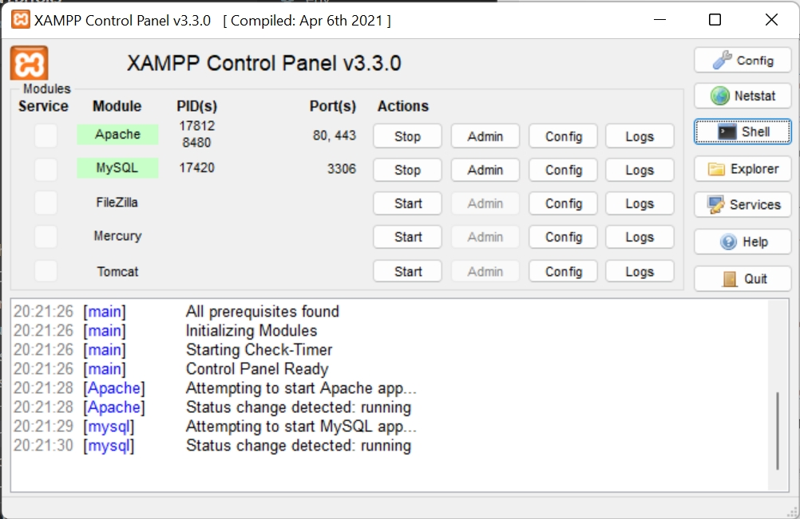
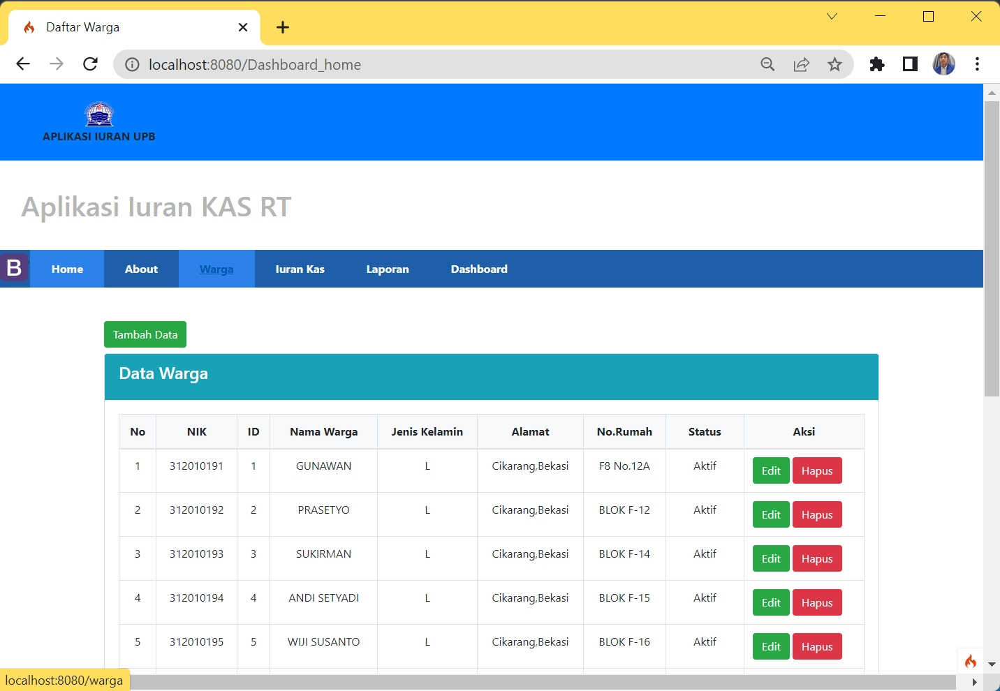

# 12_UAS_Iuran_KAS_RTWeb

UJIAN AKHIR SEMESTER 
PEMROGRAMAN WEB 
TEKNIK INFORMATIKA 
UNIVERSITAS PELITA BANGSA 

| NAMA  :| GUNAWAN |
| --- | --- |
| NIM   :| 312010191 |
| KELAS :| TI.20.B1 |
| DOSEN :| Agung Nugroho,S.Kom.,M.Kom |

# Tugas Project Ujian Akhir Semester

**Membuat Aplikasi Pengelolaan Iuran KAS RT** 
• membuat code program PHP menggunakan Framework Codeigniter 4

**``link demo : https://gunaoneweb.000webhostapp.com/ ``**  

**``link google drive/youtube : https://drive.google.com/file/d/1qUJ-sjecUcjnk50yloDKbyq8jcOfQ8Gg/view?usp=sharing ``**  

  
  **``Membuat Database``**
  
  
   **`` Konfigurasi koneksi database & Membuat Program php``**
  
  
  
   ** ``XAMPP Control Panel `` **
    
  
  
   ** ``Menjalankan CLI (Command Line Interface)``**
  
  #cd > direktori kerja project dibuat (C:\xampp\htdocs\lab12_Iuran_KAS_RT_php_ci)
  
  Perintah yang dapat dijalankan untuk memanggil CLI Codeigniter adalah: ``php spark`` dan 
  
  ``php spark serve``
  
   Selanjutnya buka browser kembali, dengan mengakses url : <http://localhost:8080/warga>
   
   
 
  
 

  
  Cukup Sekian Penjelasan Dari saya
  
  **TERIMAKASIH**

